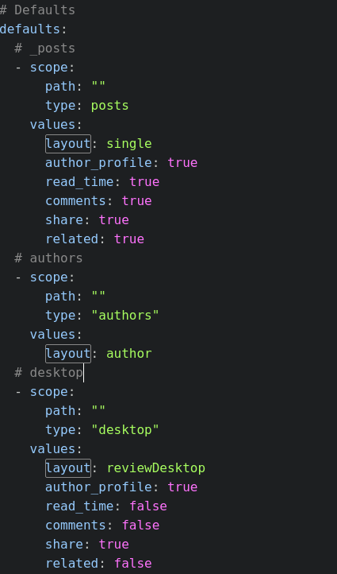
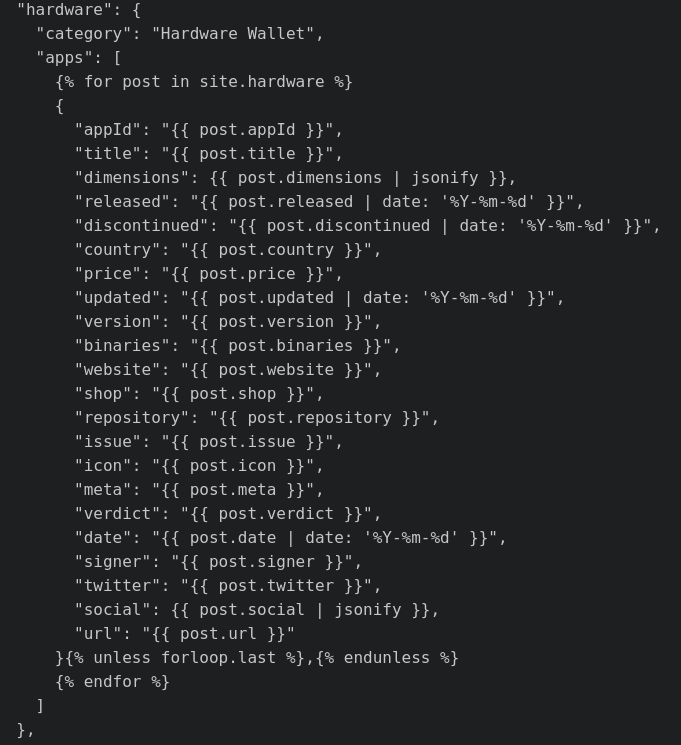

First, determine if the platform is worthy of adding. Most of the current platforms have many products in them. If this product, is the sole thing in its platform, we simply put it into **\_others**. The major platforms for the moment are: android, iPhone, bearer tokens, hardware, desktop and others.

At its most basic, adding a platform starts with these steps:

2. Create a new folder in the root directory and name it descriptively but short. As an example, we will create a new category named 'Desktop'. In the root folder of WalletScrutiny:

    `$ mkdir _desktop`
3. Also create a new folder for the icons and images in /images/wIcons.

    `$ mkdir /images/wIcons/desktop`

    `$ mkdir /images/wIcons/desktop/small`

    `$ mkdir /images/wIcons/desktop/tiny`
4. Create your first `.md` file inside the `_desktop` folder. In our example, lets call this `bitcoincore.md`

    `$ touch bitcoincore.md`
5. Populate the file with the frontmatter. For guidance, you may use some of the fields in the Android app less the irrelevant fields that you won't find in a desktop app such as Google Play reviews, etc. You may use the fields above, in the `Reviewing Android Apps` section.
6. Put a 400x400 image in /images/wIcons/desktop
6. Modify `./updateImages` to also handle `desktop` products
7. Run `./updateImages` script to automatically put a 250x250 copy of the image in 'small' and a 100x100 copy in 'tiny'.
8. In **\_config.yml** duplicate then modify the following entries to match the category you are making:
    - Under:
      - Collections

        ```yaml
          desktop:
            output: true
            permalink: /:collection/:path/
        ```
      - Defaults

        ```yaml
          desktop
          - scope:
              path: ""
              type: "desktop"
              values:
              layout: reviewDesktop
              author_profile: true
              read_time: false
              comments: false
              share: true
              related: false
        ```
9. In the **\_layouts** folder
    - Duplicate the reviewAndroid.html file. In our case we should have a new file called **reviewDesktop.html**.
    - This should match the 'layout:' field under #Defaults in \_config.yml
    
      
10. Open the **reviewDesktop.html** file we just created, search for \`\`\` tag or the word **'icon'**. Make sure it matches the directory of where the icons are stored.

### Adding the Embeddable Widgets

11. Make sure to include `desktop` in **allWallets.js** under:

    `const folders = ["hardware", "android", "iphone", "bearer", "desktop"]`
12. Make sure to include `desktop` in the file **wallets.js** under:

    `const platformOrder = "hardware,android,iphone,bearer,desktop"`
13. Edit **allAppList.html** to include desktop. This is an example entry for **Hardware**. Replace all instances of _hardware_ with `desktop`. Be sure to match the fields in the front matter of your .md files.
    
