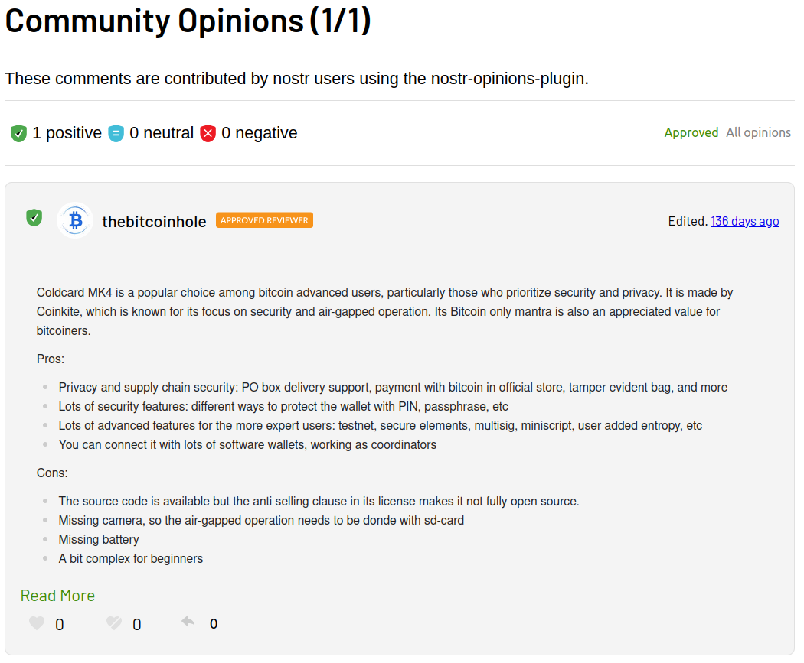
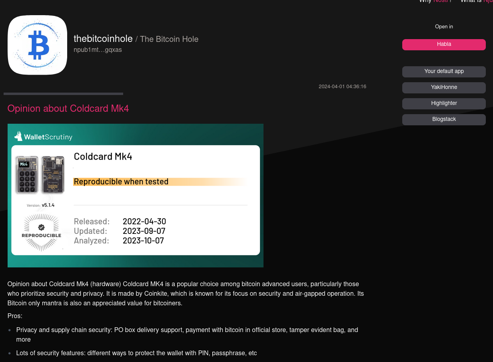
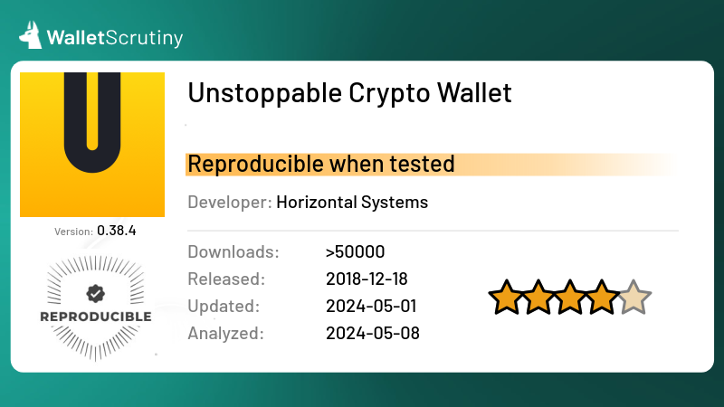
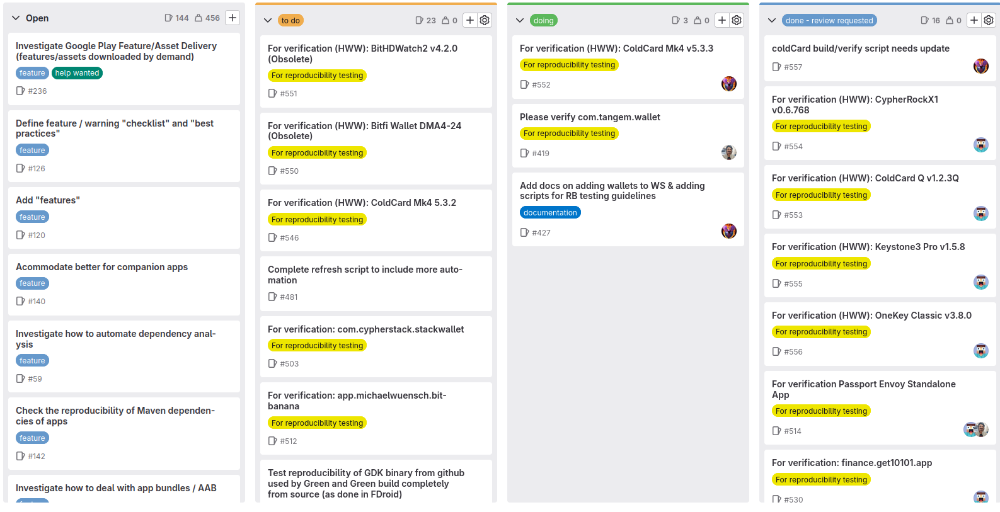

WalletScrutiny is pushing for accountability and auditability in Bitcoin wallet security. If this topic is dear to your heart, here are some ways you can help us.

- [Write opinions](#write-opinions)
- [Spread the word, say hello](#spread-the-word-say-hello-)
- [Write reviews for existing products](#write-reviews-for-existing-products)
- [Add products](#add-products)
- [Create/comment/fix issues in our issue tracker](#createcommentfix-issues-in-our-issue-tracker)

## Write opinions

Our team is committed to reviewing every available Bitcoin app or device. However, we actively welcome outside contributions and opinions, as they strengthen the collaborative spirit of the project. Firsthand knowledge, especially in source-available projects, is highly valued. This is why even providers are encouraged to express  opinions regarding their own apps or devices, provided they adhere to our guidelines. To ensure balanced perspectives, WalletScrutiny also invites opposing views that may challenge a provider's opinions.

### Nostr Opinion Plugin

The Nostr Opinion Plugin enables reviewers to share their opinions through the Nostr protocol. This ensures that reviews are not only available on WalletScrutiny.com but also accessible via various Nostr nodes and clients. This approach extends the reach of opinions beyond our website, allowing discussions to flourish on other platforms. For example, a discussion on the Primal.net website could continue seamlessly across different shared nodes, with users responding through their preferred clients.

Alongside provider attestations, the Nostr Opinion Plugin fosters a diverse range of opinions, welcoming both supporting and dissenting views. **We highly encourage constructive and respectful challenges to any review.** Open source thrives on the evolutionary process of collaborative iteration, especially in the realm of hardware and software that empowers individuals to self-custody the only true currency of our time: Bitcoin.

<figure style="text-align: center;">
  
  <figcaption>The WalletScrutiny.com Nostr Opinion Plugin</figcaption>
</figure>

Clicking on the number of days at the top right will lead to an njump page, which will allow the reader to make a reply with their Nostr client of choice.

<figure style="text-align: center;">
  
  <figcaption>Reply to an opinion using your Nostr client of choice</figcaption>
</figure>

## Spread the word, say hello! 😀

*Chat with us and share your findings.*

You can message or join the conversation on [X.com](https://x.com/WalletScrutiny),
[Nostr](https://snort.social/p/npub1j9kttlc86w63emmldd4h74rekyqpksqup6p9trhp5gjsf374qlyszvuswx),
[Discord](https://discord.gg/yVWqxHSjHH),
[Facebook](https://www.facebook.com/walletscrutiny) or
[Reddit](https://reddit.com/r/walletscrutiny)

*Connect, verify, collaborate and corroborate.*

In the same vein as Bitcoin's nature as an Open Source peer-to-peer money, WalletScrutiny thrives with its community's diverse opinions. The power of this is made evident especially when conducting reproducibility verification. It is entirely possible to get varying results when conducting builds - especially if a provider has not provided specific build instructions for reproducible builds. Open communication and transparent processes lead to best practices in this regard.

## Write reviews for existing products

If you've found that an existing review may be out-of-date, factually lacking, or may be in need of some improvement, we enthusiastically encourage you to write a review. Doing so is very easy and can be done via GitLab. 

1. Clone the walletscrutiny repository and install the dependencies as described in the [README](https://gitlab.com/walletscrutiny/walletScrutinyCom/-/blob/master/README.md) file.
2. Take note of the platform and the ID of the item you wish to review (hardware, android, apple, bearer, desktop, others) You can find the app or device ID in the URL. For example, open your browser and browse over to the entry for the ColdCard Mark 4 Hardware Wallet. You'll find in the URL: 

    `"https://walletscrutiny.com/hardware/coldcardMk4"` 

3. Open the `_hardware` folder, and the file `coldcardMk4.md`
4. In the terminal and using git, create a new branch. For instance `git checkout -b review/coldcardMk4`
5. Make your changes to the file, save.
6. Run `git add .` > `git commit -m "My excellent review for the Coldcard Mark 4"` > `git push`
7. Once pushed, make a merge request to the official WalletScrutiny.com repository.

## Add products

We encourage wallet providers to add their product to our database. If the product is source-available, we'd also value detailed instructions on how to build the app. This saves us time when performing reproducible builds.

⭐ Even better than products presented by their own providers are reviews by neutral third parties. Or additional reviews of already-reviewed products to make sure the information is correct.

- See [here](/howtoWriteAnAnalysis/) to learn how to write an Analysis.
- Read the [technical details](/howtoAddNewPlatform/) on how to add a new platform

If you know of a new and awesome wallet, feel free to share this with us and we'll include it in WalletScrutiny's ever-expanding catalog of more than 6,500 Bitcoin apps and devices. Furthermore, we have designed wallet images that make it easier and more visually appealing to share on social media.

<figure style="text-align: center;">
  
  <figcaption>WalletScrutiny Bitcoin App Social Share Cards</figcaption>
</figure>

## Create/comment/fix issues in our issue tracker

The project maintains a GitLab page where we organize activities around [**Issues**](https://gitlab.com/walletscrutiny/walletScrutinyCom/-/issues). If we find a wallet that claims to be **self-custodial** and **source-available**, this is where we put it.

⭐ **You** can also create issues if you find anything of note pertaining to the project. Simply head over [here](https://gitlab.com/walletscrutiny/walletScrutinyCom/-/issues).

⭐ [**WalletScrutiny's GitLab Issue Board**](https://gitlab.com/walletscrutiny/walletScrutinyCom/-/boards) has a nifty feature that shows **issues** as movable and interactive cards. Walletscrutiny has this implemented which makes it easier for contributors to get a bird's-eye view of all the issues at hand. It looks like this:

<figure style="text-align: center;">
  
</figure>

⭐ Issues which are in the `"To do"` column, may be picked up by anyone. Be sure to check if somebody is already assigned to it prior to assigning yourself. If nobody else is taking the issue, feel free to assign yourself and move the card to the `"Doing"` column. Once you are done addressing the issue, make a merge request and copy the url for the merge request and paste it in the comments section of the issue to show others that it is ready for review. You can now move it to the `"Done - Review Requested"` column. There it will be reviewed and once successfully merged, can finally be moved to the `"Closed"` column.

## Fund the project

WalletScrutiny is not selling any product and relies 100% on donations and grants.

Your donations will support the expenses needed to keep the project - and more importantly, the contributors, going. Security research, the development and design and the high level review of now over 6,000 products cost experts a lot of time. You can keep them happy with either a [donation](https://walletscrutiny.com/donate/) or by directly sponsoring a contributor with a grant.